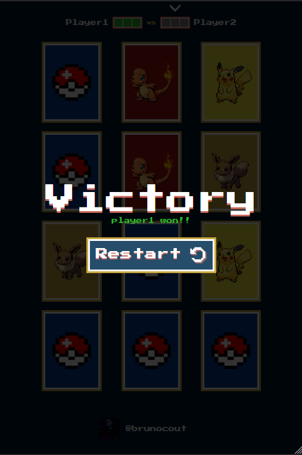
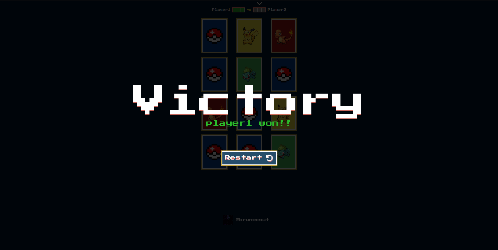
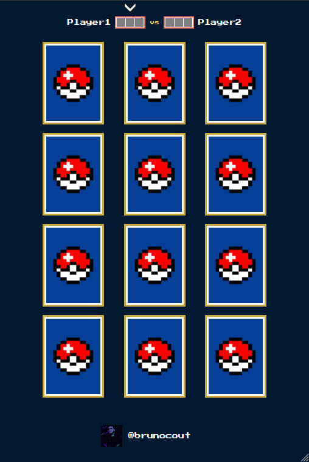
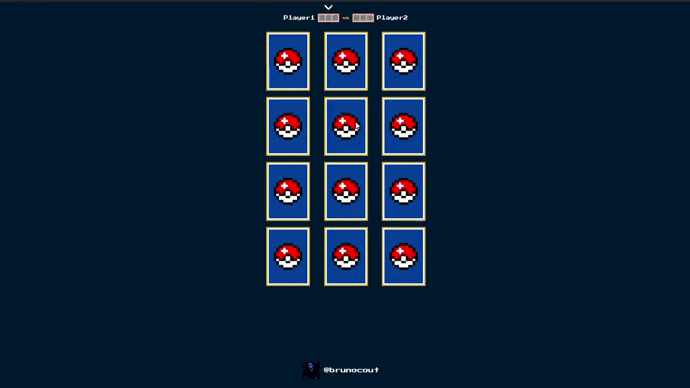

<p align="center">
  
</p>

## About the project

<p align="center">Simple Pokémon memory game with card flip functions and cards with random positions and game points.</p>

## Demo

Access the demo version of the site here:

[](https://brunocout.github.io/matching-pokemon/)

## Features

- [ ] New phases
- [ ] Screen click to start
- [ ] Change name of players
- [ ] Add more cards
- [ ] Add score players ranking

## Layout

The application layout:

### Web

<p align="center" style="display: flex; align-items: flex-start; justify-content: center;">
  
  
</p>

### Mobile

<p align="center" style="display: flex; align-items: flex-start; justify-content: center;">
  
  
</p>

### Gif

<p align="center" style="display: flex; align-items: flex-start; justify-content: center;">
  
</p>


## Technologies

The following tools are being used in building the project:

* [](https://vitejs.dev/)
* [](https://pt-br.reactjs.org/docs/create-a-new-react-app.html)
* [](https://developer.mozilla.org/pt-BR/docs/Web/JavaScript)

## Getting Started

First, run the development server:

```bash
npm run dev
# or
yarn dev
```

Open [http://localhost:3000](http://localhost:3000) with your browser to see the result.

### Autor
---

<a href="https://github.com/brunocout">
 
 <br />
</a>

Made w/ 💙 by Bruno Coutinho!

[](https://www.linkedin.com/in/brunocout/) 
[](mailto:iambrunocout@gmail.com)

##  Readme version

[ English 🇺🇸 ](./README.md)  |  [ Português 🇧🇷 ](./README-br.md)