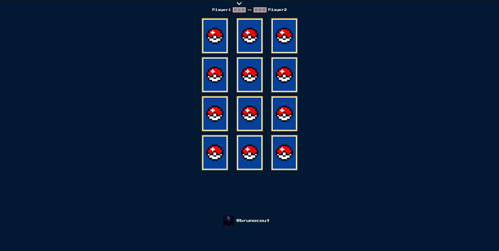

<p align="center">
  <a href="https://ant.design">
    
  </a>
</p>

##

<p align="center">Simple Pokémon memory game with card flip functions and cards with random positions and game points.</p>

<p align="center">
  🚧  🚧  
</p>

<p align="center" style="display: flex; align-items: flex-start; justify-content: center;">
  
</p>


[ English ](./README.md)  |  [ Português ](./README-br.md)

## 🕹️ Demo

Access the demo version of the website here:

[](https://brunocout.github.io/matching-pokemon/)

## ✨ Features
- [x] Base Struture
- [ ] New phases
- [ ] Screen click to start
- [ ] Change name of players
- [ ] Add more cards
- [ ] Add score players ranking

## 🎨 Layout

The application layout:

### Web

<p align="center" style="display: flex; align-items: flex-start; justify-content: center;">
  
  
</p>

### Mobile

<p align="center" style="display: flex; align-items: flex-start; justify-content: center;">
  
  
</p>

### Gif

<p align="center" style="display: flex; align-items: flex-start; justify-content: center;">
  
</p>


## ⚙️ Technologies

The following tools are being used in building the project:

* [](https://vitejs.dev/)
* [](https://pt-br.reactjs.org/docs/create-a-new-react-app.html)
* [](https://developer.mozilla.org/pt-BR/docs/Web/JavaScript)


## 🚀 Getting Started

First, run the development server:

```bash
npm run dev
# or
yarn dev
```

Open [http://localhost:3000](http://localhost:3000) with your browser to see the result.


## 💙 Autor

<a href="https://github.com/brunocout">
 
 <br />
</a>

Made w/ 💙 by Bruno Coutinho!

[](https://www.linkedin.com/in/brunocout/) 
[](mailto:iambrunocout@gmail.com)


